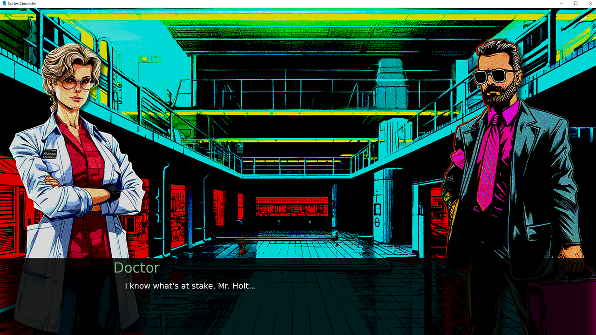

# THE CORTEX CHRONICLES, CHAPTER 1 - The Trial of Rowan Reed

Developed for the Game Creator's Club at Lusofona University.
This month, the theme was "Ren'py", so of course I used it to make this game.

This is a part of what I hope will be "The Cortex Chronicles" - I want all the games I do for the Game Creator's Club this year to be linked together, hence this idea.
I also want to use a different engine on every entry, so let's see how that goes! :)

The game is a simple Visual Novel, in which we play as Rowan Reed, a librarian in a dystopic future where mankind is controlled by the Prime Nexus, a human-AI hybrid.

## Art

Art was done using Midjourney, and then processed in Photoshop to give the high-res ZX-Spectrum look I was looking for.

## Licenses

* All game source code by Diogo de Andrade is licensed under the [MIT] license.
* All art by Diogo de Andrade, available throught the [CC0] license.

## Metadata

* Autor: [Diogo Andrade]

[Diogo Andrade]:https://github.com/DiogoDeAndrade
[OkapiKit]:https://github.com/VideojogosLusofona/OkapiKit
[NaughtyAttributes]:https://github.com/dbrizov/NaughtyAttributes
[Midjourney]:https://www.midjourney.com/home/
[ZiNGOT]:https://opengameart.org/content/alien-breed-esque-top-down-tilesheet
[chabull]:https://opengameart.org/users/chabull
[CC0]:https://creativecommons.org/publicdomain/zero/1.0/
[CC-BY 3.0]:https://creativecommons.org/licenses/by/3.0/
[The Planet]:http://planet.dk/
[MIT]:LICENSE
